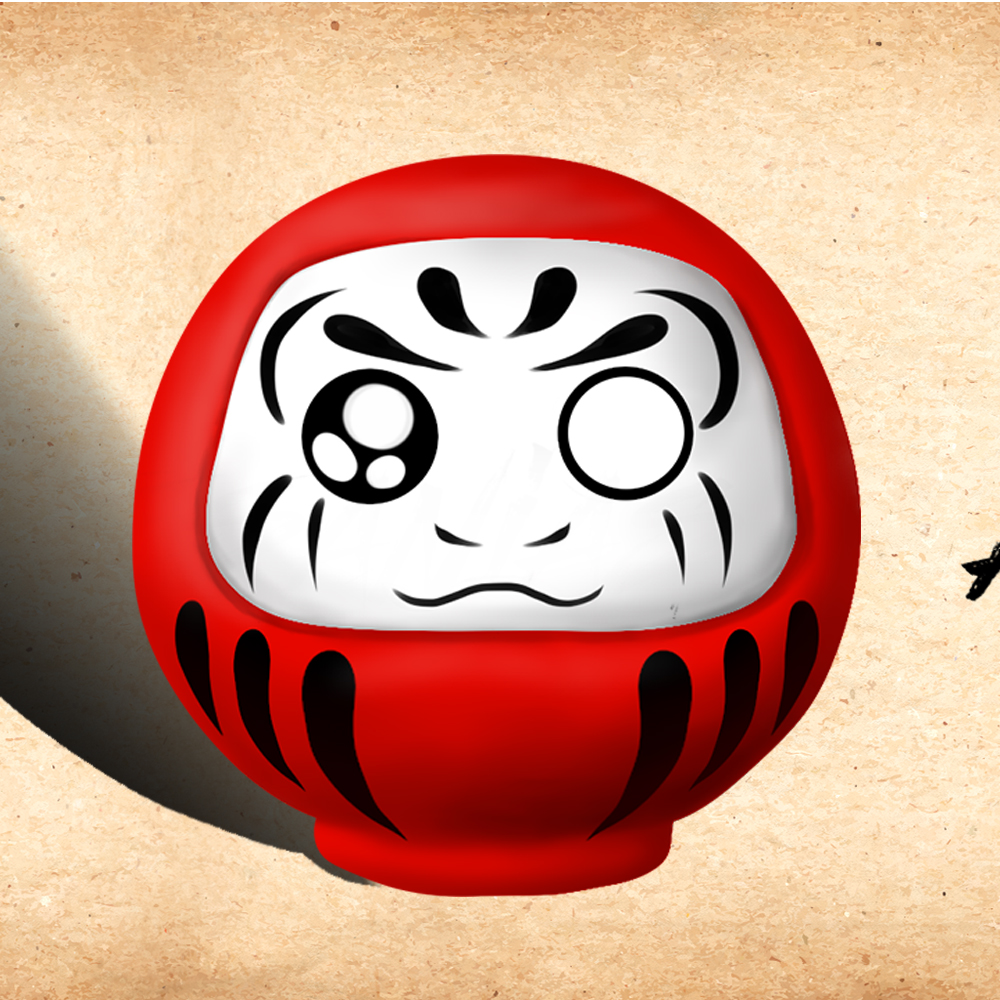

# Mi portfolio html/css

## Secciones

* *Barra de Navegacion*
* *Portada*
* *Mis conocimientos*
* *Cita*
* *Mis proyectos*
* *Seccion de Contacto y Formulario*
* *Footer*

***
* Barra de Navegacion consta de links correspondiente a cada seccion del portfolio.
***
* Portada consta de una breve presentacion con mi nombre y mis actividades principales
***
* Mis conocimientos contiene imagenes de los conocimientos a adquirir en lo que resta del año.
***
* Cita.
Cuenta con una frase de Daisaku Ikeda.

```Daisaku Ikeda es un constructor de la paz, un filósofo budista, un promotor de la educación, escritor y poeta.  Es el presidente fundador de la Soka Gakkai Internacional (SGI), la cual es una de las asociaciones budistas de base comunitaria más diversa y más numerosa del mundo, dedicada a fomentar el empoderamiento humano y la contribución social en aras de la paz. Es también fundador de las instituciones educativas Soka y de entidades internacionales dedicadas a promover la paz, la cultura y la educación.```
***
* Mis proyectos
Esta formada por varias "cards", dos de las cuales son proyectos personales:

1- Daruma artesanias [@darumaartesanias].
   Proyecto en base a amigurumis y modelado de una pasta especial para decoracion y reciclado de frascos de distinto material
   . Este es el logo original utilizado en mi pagina, el cual modifique los colores para mantener armonia dentro del portfolio
   
2- Rugido de un leon [@rugidodeunleon]. Pagina basada en alientos y enseñanzas de la filosofia budista de Nichiren Daishonin
***
* Seccion de Contacto y Formulario de contacto. Contiene iconos de redes sociales los cuales clikeando en ellos se re-dirigen a cada pagina correspondiente.
***
* Footer. Cierre de portfolio con links
***
***
## Colores utilizados ## 
 *Segun la psicologia del color los tonos naranjas utilizados en mi portofolio representa principalmente la alegría, el entusiasmo , lo divertido y actitud positiva. Utilice sombras y degradados del naranja, informacion extraida de (https://coloreshtml.site/naranja/#esquemas-y-armon%C3%ADas-del-color-naranja-complementario-an%C3%A1logos-dividido-tr%C3%ADada-cuadrado-tetr%C3%A1dica).
 Los colores utilizados fueron:
  #ffa500, #ffd78e, #835c00, #ffe1aa, #ffc355 y chocolate.*
  ## Imagenes utilizadas ##
  Las imagenes fueron descargadas desde (https://iconos8.es/)


   